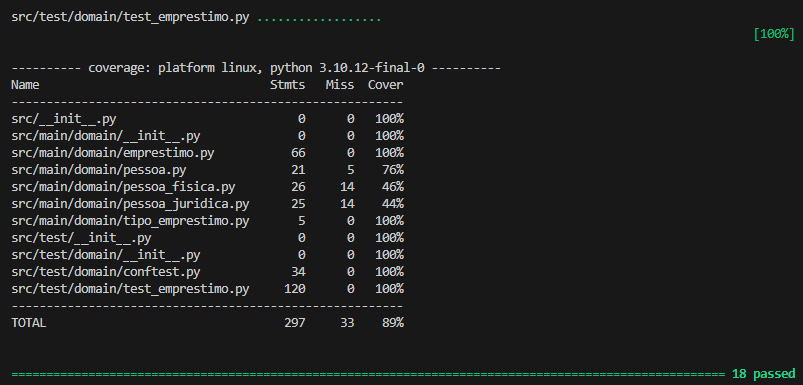
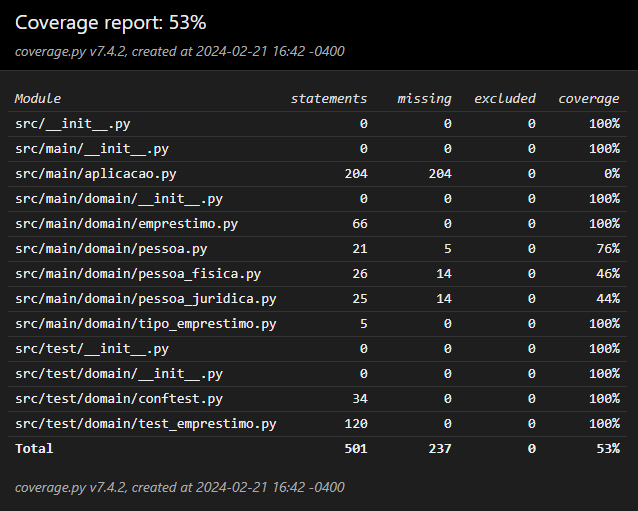

## Sistema de Empréstimos

Esse desafio foi feito utilizando Python para aplicação e Pytest para os testes unitários. O mesmo não possui interface gráfica, sendo necessário realizar todas as operações via linha de comando CMD. Os requisitos para implementação desse desafio se encontram no diretório <b><i>desafio/</i></b> e possui 5 exercícios. Para cada exercicio um foi criado uma branch com o prefixo pdf (ex: <b><i>pdf-1</i></b>) para simbolizar qual exercício foi realizado no mesmo. Ao final de cada exercicio foram criados pull requests para enviar o código para a branch main.

### Requisitos:
- [Instalar Git](https://git-scm.com/downloads)
- [Instalar python](https://www.python.org)
- [Instalar pip](https://pypi.org/project/pip/)

### Dependências:
- [pytest](https://docs.pytest.org/)
- [pytest-cov](https://pypi.org/project/pytest-cov/)


### Estrutura do projeto:
```
emprestimo$ tree
.
├── README.md
├── coverage-cmd.png
├── coverage-html.png
├── desafio
│   ├── Exercicio Bonus.pdf
│   ├── Exercicio1.pdf
│   ├── Exercicio2.pdf
│   ├── Exercicio3.pdf
│   └── Exercicio4.pdf
├── requirements-test.txt
└── src
    ├── __init__.py
    ├── main
    │   ├── __init__.py
    │   ├── aplicacao.py
    │   └── domain
    │       ├── __init__.py
    │       ├── emprestimo.py
    │       ├── pessoa.py
    │       ├── pessoa_fisica.py
    │       ├── pessoa_juridica.py
    │       └── tipo_emprestimo.py
    └── test
        ├── __init__.py
        └── domain
            ├── __init__.py
            ├── conftest.py
            └── test_emprestimo.py

6 directories, 22 files
```

## Como executar o projeto:

1. Para executar o projeto você deve ter instalado em sua máquina o python3 ou superior e também o gerenciador de pacotes pip, ambos devem ser instalados conforme recomendação e com base no sistema operacional utilizado.

2. Clone o repositório do projeto que se encontra no github [nesse link](https://github.com/LuizPauloS/emprestimo-py).

3. Pelo CMD acesse a raiz do projeto com o comando:
    ```
    cd emprestimo-py/
    ```

4. Instale as dependências do projeto com o comando:
    ```
    pip install -r requirements-test.txt
    ```

5. Para inciar a aplicação execute o comando:
    ```
    python3 -m src.main.aplicacao
    ```

6. Para executar os testes unitários execute o comando:
    ```
    pytest src/test/
    ```

7. Para obter a cobertura de testes unitários via CMD execute o comando:
    ```
    python3 -m pytest --cov
    ```
    

8. Para gerar o relatório de cobertura de testes em formato html execute o comando: 
    ```
    python3 -m pytest --cov=./ --cov-report html
    ```
    Obs:. O relatório de cobertura será gerado no diretório <b><i>htmlcov/</i></b> na raiz do projeto, para visualizar, abra o arquivo index.html em um navegador. Ao abri-lo no navegador é possível navegar nas classes onde aparece a cobertura, em verde o que já se encontra coberto e em vermelho o que ainda necessita de teste. Os diretórios e arquivos gerados ao executar o comando, foram adicionados ao .gitignore para que não sejam commitados no repositório.

    Exemplo de relatório gerado:

    